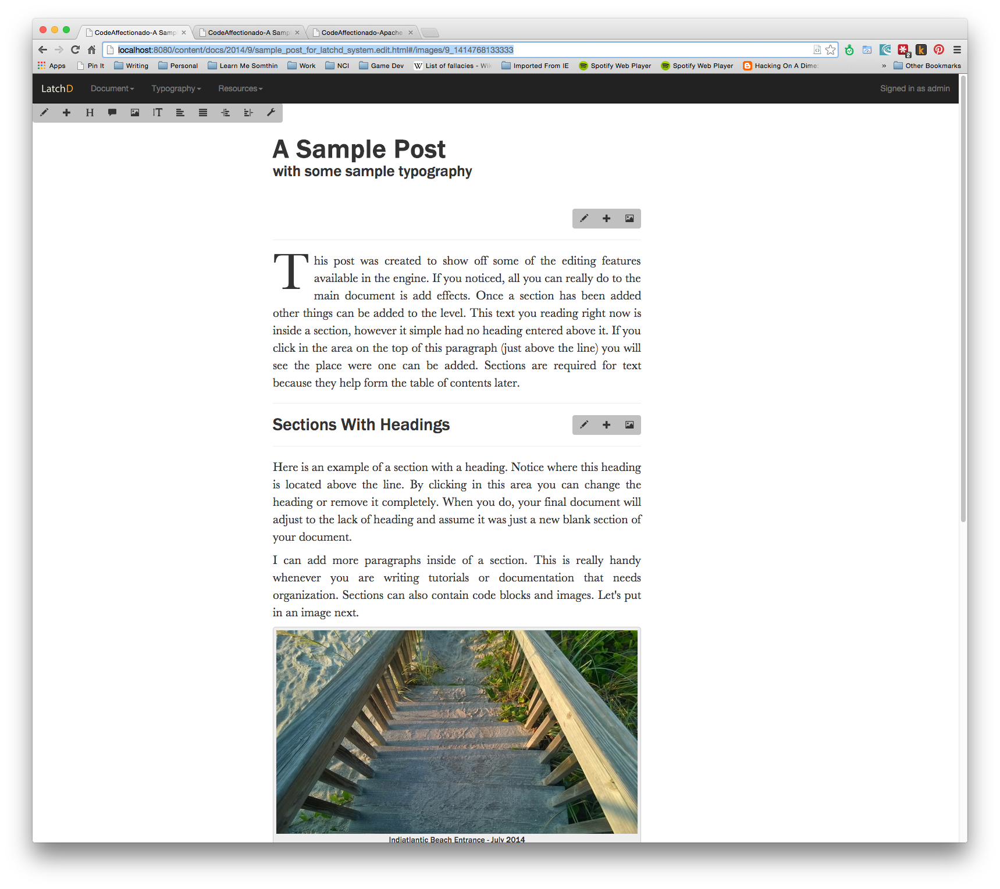

e](https://waffle.io/PlasmaTrout/latchd-content-engine)
# LatchD Documentation Engine
This document engine is a work in progress that's not quite ready for primetime. The goal is make a documentation system that helps me write better and more uniformly. The editor restricts massive creativity in order to provide better looks and tooling. 
 

 
 Is displayed as:
 


To normal readers or visitors.

## Mission
The vision of LatchD has gone through several iterations over the last few years,
but one thing remains a constant: Web typography is horrible. It's getting better,
don't get me wrong, but it's still horrible. The LatchD engine attempts to deliver
a minimal writing and editing experience by improving on the typography and
workflow used to create documentation, blogs, technical books and novels in a
web based format.

## Developing
This project uses Apache Sling 7 as its framework. After starting Apache Sling navigate
to the root of the project and run:

```
mvn -PautoInstallBundle install
```

To install the project. Once installed you should be able to see the following pages:

* http://localhost:8080/content/landing.html
* http://localhost:8080/content/docs/2014/9/sample_post_for_latchd_system.html
* http://localhost:8080/content/tutorials/osgi/apache_felix_first_steps.html

If you change the selectors to edit.html you can access the editable content:

* http://localhost:8080/content/docs/2014/9/sample_post_for_latchd_system.edit.html
* http://localhost:8080/content/tutorials/osgi/apache_felix_first_steps.edit.html

Clicking on each paragraph of text or control is used to present its editable dialog, however 
most content is content editable.

If you want to upload a image temporarily to play around the URL

* http://localhost:8080/content/media/photo.new.html

is where you want to go.

